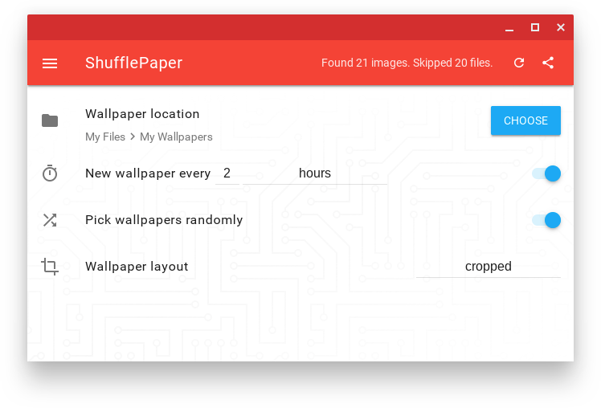
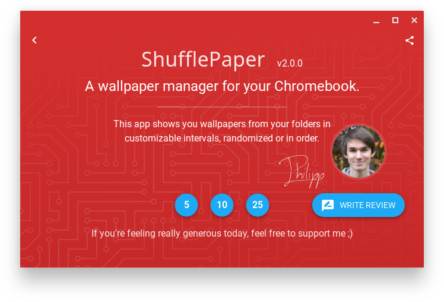
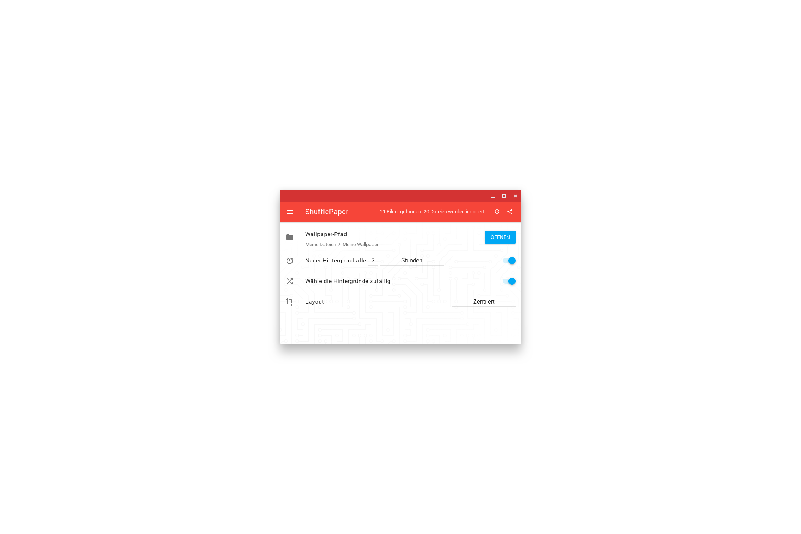
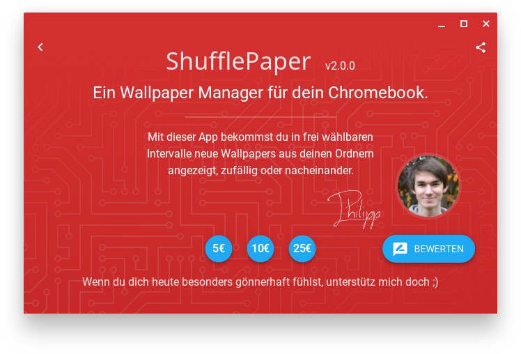

# ShufflePaper
A wallpaper manager for Chrome OS.

Wallpapers are picked randomly or in order in an interval depending on your choice.

### Table of contents
- [Features](#features)
- [Changelog](#changelog)
- [Screenshots](#screenshots)
- [Installation](#installation)

---

### Features:
- Select a folder with your wallpapers
- Optional: Customizable delay between wallpaper changes
- Optional: Shuffle wallpapers randomly
- 3 different wallpaper modes (stretched, centered & cropped)

### Changelog
#### v2.0.0:
- **New icon**
- **New design**
- **Feature:** Expanded possible folders to everything currently supported by Chrome OS
- **Feature:** Subfolders are now included when searching for the next image
- **Feature:** The number of images and non-images is now displayed at the top
- **Feature:** Improved path formatting
- **Bugfix:** Settings weren't saved properly
- **Stability:** Under the hood code improvements

> **Hidden changes**
> - Added notifications to build a rapport with the user and to notify of updates
> - Added snackbar to notify of events while the app is open
> - Added donation buttons
> - Created a [project website](https://github.com/ciriousJoker/shufflepaper-website)

#### v1.2.1:
- **Bugfix:** Layout settings and random mode weren't saved properly

#### v1.2.0:
- **Bugfix:** Folder couldn't be selected properly

#### v1.1.0:
- **Feature:** 3 different wallpaper modes (stretched, centered & cropped)

#### v1.0.0:
- **Feature:** New design
- **Feature:** Customizable delay between wallpaper changes
- **Feature:** Share button
- **Stability:** Improved error handling
- **Bugfixes**
- **Languages:** Added German

#### v0.9.2:
- **Bugfix**

#### v0.9.1:
- **Bugfix:** External folder paths werern't formatted properly
- **Feature:** Interface improvements
- **Stability:** Now checks if the next file is actually an image

#### v0.9.0:
- **Initial release**

### Screenshots

|                      Main (en)                       |                      About (en)                       |
| ------------------------------------------------ | ------------------------------------------------ |
|   |   |

|                      Main (de)                       |                      About (de)                       |
| ------------------------------------------------ | ------------------------------------------------ |
|   |   |

## Installation

Only Chrome OS devices are supported as the [wallpaper api](https://developer.chrome.com/apps/wallpaper) isn't available on other platforms.

[Or click here](https://github.com/CiriousJoker/ShufflePaper/releases/latest) to go to the latest release here on Github.
