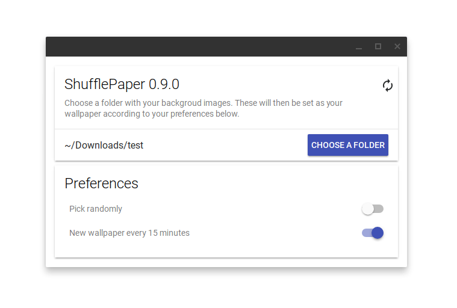

# ShufflePaper
Choose a folder and have your Chromebook automatically shuffle through the wallpapers in it!

## Installation

Only Chrome OS devices are supported as the [wallpaper api](https://developer.chrome.com/apps/wallpaper) isn't available on other platforms.

## Version history

**v0.9.2:**

- Small bugfix

**v0.9.1:**

- Fixed a visual bug when selecting external folders
- Small improvements to the interface
- Check if the file is in either the jpeg or png format before trying to set it as a wallpaper

**v0.9.0: (initial relerase)**

- Select a folder
- Toggle: New wallpaper every 15 minutes
- Toggle: Random mode instead of alphanumerically ordered wallpapers

## Legal

Icon made by [Popcorns Arts](http://www.flaticon.com/authors/popcorns-arts) from [Flaticon](www.flaticon.com).