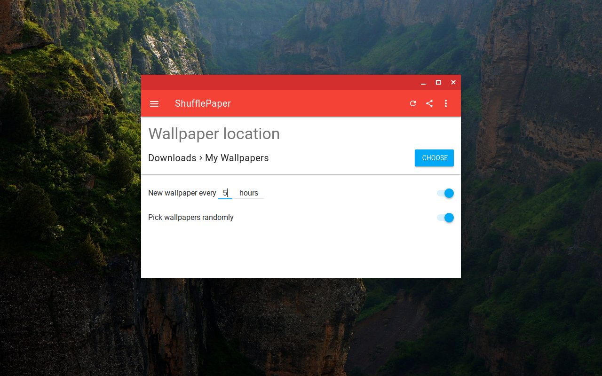
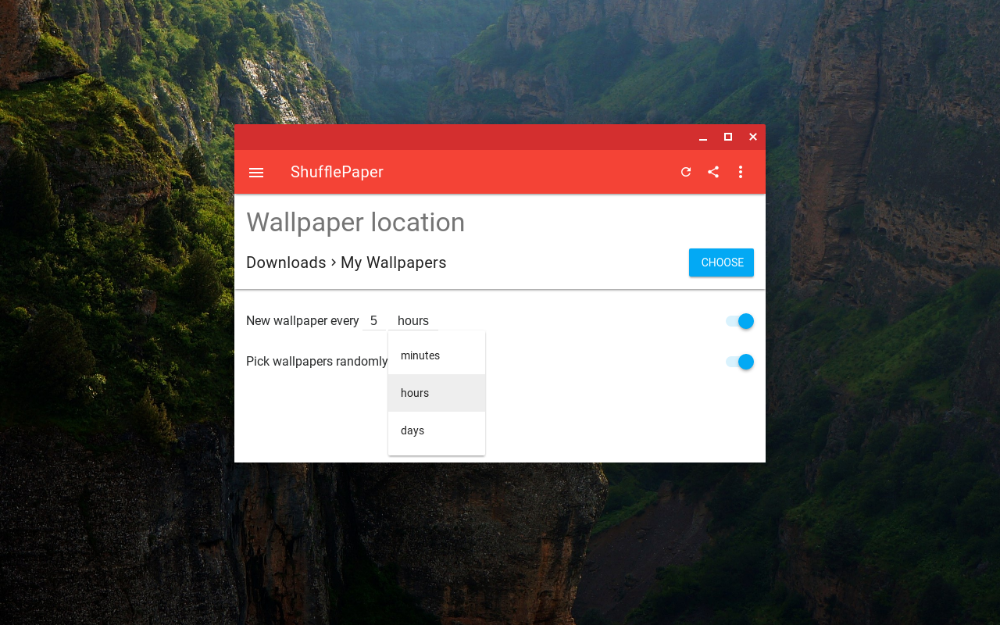
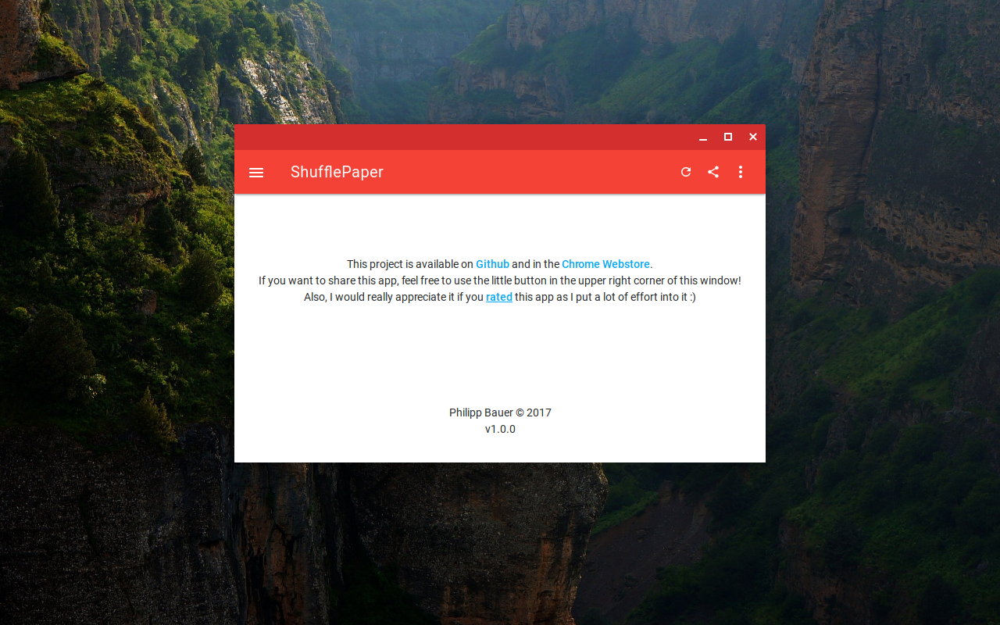

# ShufflePaper
Choose a folder and have your Chromebook automatically shuffle through the wallpapers in it!

**IMPORTANT:**

The files in the assets folder (the icons) are replaced with empty icons in order to comply with the copyright rules of Flaticon. The packaged apps in the Chrome Web Store and the .crx files in the [releases](https://github.com/CiriousJoker/ShufflePaper/releases/latest) still contain the icons, but I'm not allowed to distribute them as files.

## Features (v1.1.0)
- Select a folder with images you want to use as wallpaper candidates
- Button: Manually change wallpaper
- Optional: Customizable delay between wallpaper changes
- Optional: Shuffle images randomly
- 3 different wallpaper modes (stretched, centered & centered+cropped)

## Screenshots (v1.0.0)

|                      Delay                       |                      About                       |
| ------------------------------------------------ | ------------------------------------------------ |
|   |   |

## Installation

Only Chrome OS devices are supported as the [wallpaper api](https://developer.chrome.com/apps/wallpaper) isn't available on other platforms.

[Click here](https://github.com/CiriousJoker/ShufflePaper/releases/latest) to go to the latest release here on Github.

## Legal

Icon made by [Popcorns Arts](http://www.flaticon.com/authors/popcorns-arts) from [Flaticon](www.flaticon.com).